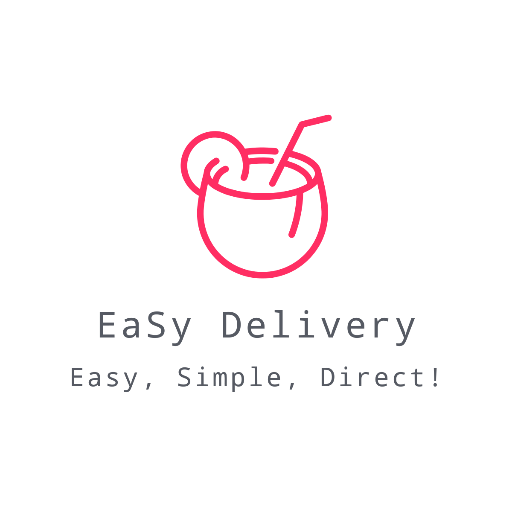

# Elysion EaSy Delivery Microservices 

[](http://inch-ci.org/github/benjaminwongweien/elysion)
[](https://codebeat.co/projects/github-com-benjaminwongweien-elysion-master)

<p align="center">
  
</p>


EaSy Delivery is a Microservice Driven Solution for Food Delivery.

# Features!
  - CRM Microservice 
  - Menu Microservice
  - RabbiMQ AMQP Messaging Broker
  - Payment Microservise using Stripe API   
  - Notfication Microservice using Telegram API
  - Order Process Microservice built on Spring Boot
  - Web UI with Google and Facebook Login Enabled
  - Recommendation Microservice using Google Maps API

### Tech

EaSy Delivery uses a number of open source projects to work properly:

* [Flask](https://palletsprojects.com/p/flask/) - A lightweight WSGI web application framework.
* [Docker](https://www.docker.com) - Empowering App Development for Developers.
* [Stripe](https://stripe.com/en-sg) - Online payment processing for internet businesses.
* [RabbitMQ](https://www.rabbitmq.com/) - One of the most popular open source message brokers.
* [Bootstrap](https://getbootstrap.com/) - The most popular HTML, CSS, and JS library in the world.
* [Spring Boot](https://spring.io/projects/spring-boot) - Create  stand-alone, production-grade Spring based Applications that you can "just run".

### Installation

EaSy Delivery requires [Docker](https://www.docker.com) and [Docker Compose](https://docs.docker.com/compose/install/) to run.

Please install the dependencies to start the server.

```sh
$ cd ${microservice_directory}
$ docker-compose up -d
```

This will compose the required EaSy Delivery images and pull in the necessary dependencies. Be sure to swap out `${microservice_directory}` with the actual location of each microservice on your machine.

### Ports

| Microservice                    | Exposed |  :  | Internal | Link                   |
| ------------------------------- | ------: | :-: | -------- | :--------------------: |
| UI - NGINX                      | 443     |  :  | 443      | https://localhost/     |
| UI - PHP-FPM                    | -       |  :  | 9000     | -                      |
| Menu - NGINX                    | 85      |  :  | 80       | http://localhost:85/   |
| Menu - Flask                    | -       |  :  | 8000     | -                      |
| Menu - PostgresDB               | -       |  :  | 8000     | -                      |
| Payment Facilitation - NGINX    | 86      |  :  | 80       | http://localhost:86/   |
| Payment Facilitation - PHP-FPM  | -       |  :  | 9000     | -                      |
| Payment Facilitation - Composer | -       |  :  | -        | -                      |
| CRM - NGINX                     | 88      |  :  | 80       | http://localhost:88/   |
| CRM - Flask                     | -       |  :  | 8000     | -                      |
| CRM - PostgresDB                | -       |  :  | 8000     | -                      |
| Recommendation - NGINX          | 89      |  :  | 80       | http://localhost:89/   |
| Recommendation - Flask          | -       |  :  | 8000     | -                      |
| RabbitMQ Broker                 | 5673    |  :  | 5672     | http://localhost:5673/ |
| RabbitMQ Management             | 15673   |  :  | 15672    | http://localhost:15673/| 
| Order Processing - Spring Boot  | 8080    |  :  | 8080     | http://localhost:8080/ |
| Order Processing - MySQL        | -       |  :  | 3306     | -                      |          

### Todos

 - Finish API Gateway 
 - System Integration Tests

License
----
**Free Software, Hell Yeah!**
